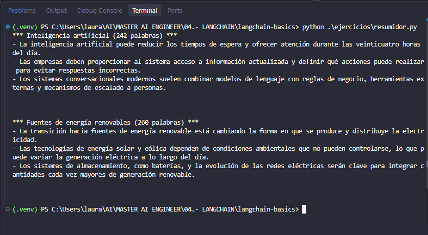
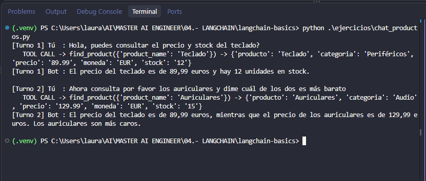

# LangChain Fundamentals

## Overview

This project contains two hands-on exercises exploring core LangChain concepts, from building a simple LCEL chain to combining tool calling with conversational memory.

Both applications use a local Llama 3.1 model through Ollama.

## 1. Text Summarizer

The first application implements a text summarization pipeline using LangChain Expression Language (LCEL).

The chain follows a simple composition:

```text
Prompt → LLM → Output Parser
```

It uses:

- `ChatPromptTemplate` to define the summarization instructions
- `ChatOllama` to interact with a local Llama 3.1 model
- `StrOutputParser` to convert the model response into a string
- LCEL pipe syntax to compose the components
- Output validation to ensure that the summary contains exactly three bullet points

Two different texts are used to test the same reusable chain.



## 2. Product Assistant

The second application extends the basic chain with tool calling and conversational memory.

The assistant can query a product catalog stored in CSV format through a dedicated tool. The model decides when the tool is required and uses the retrieved product information to answer the user.

The application also maintains conversation history, allowing later turns to reference information obtained earlier in the same session.

The example conversation demonstrates this by:

1. Asking for the price and stock of a keyboard
2. Asking for the price of headphones and comparing them with the previously retrieved keyboard

The second turn requires the assistant to combine new information from the tool with information retained from the conversation history.

Key concepts include:

- LangChain tools
- LLM tool calling
- `RunnableWithMessageHistory`
- Session-based conversational memory
- Agent scratchpad
- Iterative tool execution
- External data retrieval from CSV



## Project Structure

```text
04-langchain/
├── src/
│   ├── summarizer/
│   │   ├── summarizer.py
│   │   └── output.png
│   └── product_assistant/
│       ├── product_assistant.py
│       ├── products.csv
│       └── output.png
├── .python-version
├── pyproject.toml
├── uv.lock
└── README.md
```

## Requirements

- Python 3.12+
- [Ollama](https://ollama.com/)
- Llama 3.1 available locally

The Python dependencies are managed with `uv`.

## Setup

Install the project dependencies:

```bash
uv sync
```

Make sure the required Ollama model is available:

```bash
ollama pull llama3.1
```

## Running the Examples

Run the summarizer:

```bash
uv run python src/summarizer/summarizer.py
```

Run the product assistant:

```bash
uv run python src/product_assistant/product_assistant.py
```

## Code Quality

The project uses Ruff for linting and MyPy for static type checking:

```bash
uv run ruff check src
uv run mypy src
```

## Key Takeaway

LangChain provides composable abstractions that make it possible to evolve from a simple LLM pipeline into applications that combine model reasoning, external tools, and conversational state.

The main progression in this project was moving from a deterministic LCEL pipeline to a conversational workflow where the model can decide when external information is required and reuse previously collected context.
