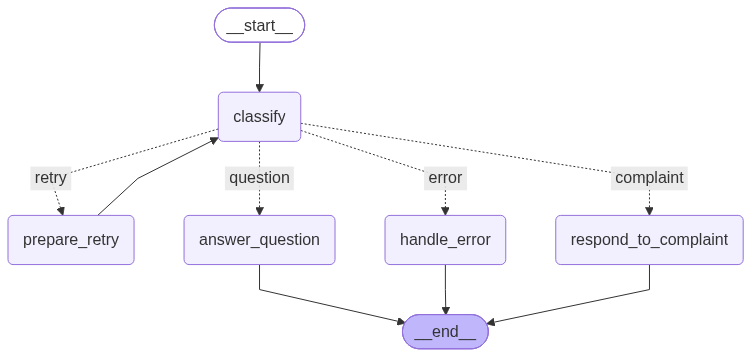
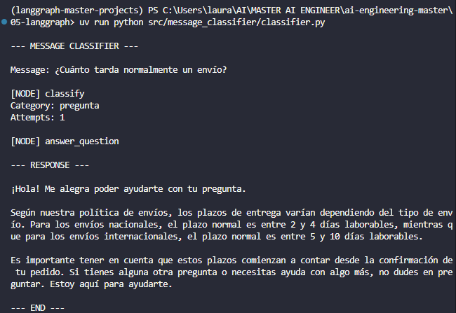
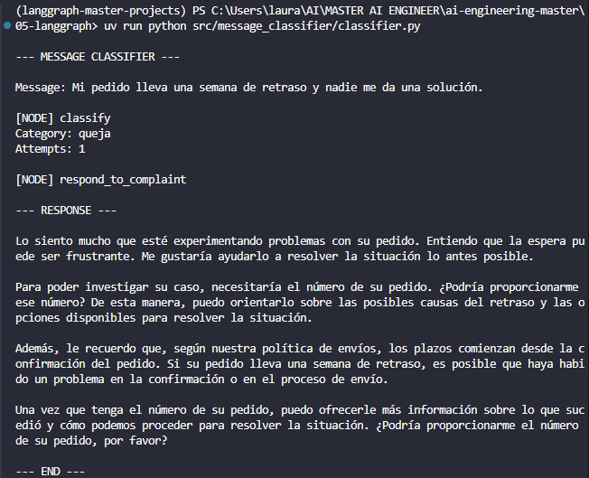
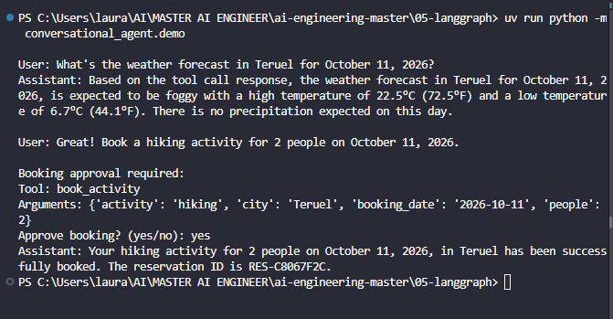
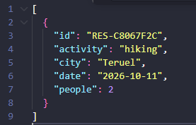

# LangGraph — Stateful Workflows and Conversational Agents

Hands-on projects developed as part of my AI Engineering Master's program, exploring state management, conditional routing, error handling, and conversational agents with LangGraph.

## Projects

### 1. Customer Message Classifier

A stateful customer support workflow that classifies incoming messages as questions or complaints and routes them to specialized response nodes.

The example uses **NovaShop**, a fictional e-commerce company with predefined shipping and customer support policies.

**Key concepts:**
- State management with `TypedDict`
- Structured LLM output with Pydantic
- Conditional routing between graph nodes
- Retry loops with state updates
- Maximum retry limits and error handling
- Step-by-step execution using LangGraph streaming

**Tech stack:** Python, LangGraph, LangChain Ollama, Pydantic, Ollama (`llama3.1`).

#### Graph Architecture



The workflow begins with a classification node. Depending on the classification result, the graph follows one of four possible paths:

| Route | Destination | Behavior |
|---|---|---|
| `question` | `answer_question` | Generates an answer using the fictional company context |
| `complaint` | `respond_to_complaint` | Generates an empathetic response to a customer complaint |
| `retry` | `prepare_retry` | Updates the state with retry instructions and returns to classification |
| `error` | `handle_error` | Returns a fallback response after exhausting the allowed attempts |

The graph uses explicit conditional edges to control transitions between nodes.

#### State Management

The workflow maintains a shared state containing:

| Field | Purpose |
|---|---|
| `message` | Original customer message |
| `category` | Classification result: question, complaint, or `None` |
| `answer` | Generated response |
| `classification_attempts` | Number of classification attempts |
| `classification_error` | Error recorded during classification |
| `retry_instructions` | Additional instructions for a subsequent attempt |

Each node returns updates to the shared state, which LangGraph propagates through the workflow.

#### Retry and Error Handling

The classifier supports a bounded retry mechanism to handle invalid classification results.

1. The `classify` node attempts to classify the customer message.
2. If classification succeeds, the graph routes to the appropriate response node.
3. If classification fails, the error and attempt count are recorded in the state.
4. The conditional routing function checks whether additional attempts are available.
5. If retries remain, `prepare_retry` adds instructions based on the previous error and returns control to `classify`.
6. If the maximum number of attempts is reached, the graph routes to `handle_error`.

The retry limit prevents an infinite loop.

The project also includes configurable **simulated classification failures** to demonstrate and test the retry and error-handling paths deterministically. These simulated failures are a testing mechanism, not actual LLM failures.

#### Execution Examples

**Question classification**



The message is classified as a question and routed to `answer_question`.

**Complaint classification**



The message is classified as a complaint and routed to `respond_to_complaint`.

Both examples show the executed nodes, classification result, number of attempts, and generated response.

#### Running the Project

**Prerequisites:**
- Python 3.12
- [uv](https://docs.astral.sh/uv/)
- [Ollama](https://ollama.com/)
- The `llama3.1` model available locally

Pull the model:

```bash
ollama pull llama3.1
```

From the `05-langgraph` directory, install the dependencies:

```bash
uv sync
```

Run the classifier:

```bash
uv run python src/message_classifier/classifier.py
```

The selected test message and retry settings can be changed in `src/message_classifier/config.py`.

**Test scenarios**

| `SIMULATED_FAILURES` | Expected behavior |
|---|---|
| `0` | Successful classification on the first attempt |
| `1` | One simulated failure; classification on the second attempt |
| `2` | Two simulated failures; classification on the third attempt |
| `3` | Three simulated failures; fallback through `handle_error` |

These scenarios assume the real classification succeeds when it is allowed to run. `MAX_ATTEMPTS` defaults to `3`.

To test both classification branches, set `TEST_MESSAGE` to either `QUESTION_MESSAGE` or `COMPLAINT_MESSAGE` in `config.py`.

#### Project Structure

```text
src/message_classifier/
├── classifier.py
├── config.py
├── prompts.py
├── graph_classifier.png
└── screenshots/
    ├── question.png
    └── complaint.png
```

- `classifier.py`: State definition, graph nodes, conditional routing, compilation, and execution.
- `config.py`: Test messages, fictional company context, and retry configuration.
- `prompts.py`: Prompt-building functions for classification, responses, and retries.
- `graph_classifier.png`: Generated graph visualization.
- `screenshots/`: Execution evidence for both classification branches.

#### Design Decisions

**Explicit graph control:** Conditional edges determine which node executes next, keeping routing behavior visible and predictable.

**Structured classification:** Pydantic constrains the classification result to the supported categories.

**Bounded retries:** Failed classification attempts are tracked in the shared state, with an explicit termination condition.

**Separation of concerns:** Graph orchestration, configuration, and prompt construction are kept in separate modules.

**Fictional business context:** NovaShop provides example policies for response generation without relying on real company systems or external integrations.

**Local execution:** Ollama enables the workflow to run with a locally hosted language model.

---

### 2. Conversational Agent with Memory and Tools

A conversational agent built with LangGraph and a locally hosted LLM. The agent retrieves real weather forecasts and simulates activity bookings while maintaining conversational state. Booking operations require explicit human approval before execution.

**Key concepts:**
- Conversational state management with `add_messages`
- Tool calling with Ollama (`llama3.1`)
- Conditional routing between graph nodes
- External weather data retrieval through Open-Meteo
- Human-in-the-loop authorization with `interrupt()` and `Command(resume=...)`
- Conversation checkpointing with `MemorySaver`
- Separation of tool authorization and execution

**Tech stack:** Python, LangGraph, LangChain, Ollama, Open-Meteo, HTTPX, pytest.

#### Graph Architecture

The agent uses three nodes:

| Node | Responsibility |
|---|---|
| `assistant` | Invokes the LLM to respond or request tool calls |
| `authorization` | Automatically allows weather queries, requests human approval for bookings, and rejects unknown tools |
| `execution` | Runs authorized tool calls and returns denial messages for rejected calls |

The main execution flow is:

```text
START → assistant → authorization → execution → assistant
            │
            └── END (when no tool calls are requested)
```

The `assistant` node routes directly to `END` when its response contains no tool calls. Otherwise, the graph proceeds through authorization and execution before returning to the assistant.

#### Tools

**Weather retrieval — `get_weather`**

Retrieves weather forecasts from the Open-Meteo API. This read-only tool is automatically authorized by the workflow.

**Activity booking — `book_activity`**

Simulates an activity reservation and saves confirmed bookings in a local JSON file. The graph pauses before this tool can execute and asks the user to approve the specific booking arguments.

This is a simulated booking system, not a connection to a real reservation provider.

#### Human-in-the-Loop Authorization

When the LLM requests `book_activity`, the `authorization` node calls `interrupt()` with the tool name, arguments, and tool-call ID. The user can approve or reject the operation, and execution resumes with `Command(resume=True)` or `Command(resume=False)`.

Only explicitly approved booking calls reach the tool executor. Rejected calls receive a denial message, and unknown tools are rejected by default.

#### Conversation Memory

The graph is compiled with `MemorySaver` and uses a `thread_id` to associate checkpoints with a conversation. This enables a paused graph to resume after the user responds to an approval request.

`MemorySaver` stores checkpoints in memory only: state does not persist after the Python process exits.

#### Running the Agent

**Prerequisites:**
- Python 3.12
- [uv](https://docs.astral.sh/uv/)
- [Ollama](https://ollama.com/) running locally
- The `llama3.1` model available locally

Pull the model if needed:

```bash
ollama pull llama3.1
```

From the `05-langgraph` directory, install the dependencies:

```bash
uv sync
```

Run the conversational agent example:

```bash
uv run python -m conversational_agent.agent
```

The example requests an activity booking and asks for confirmation in the terminal. Confirmed simulated bookings are saved locally; rejected bookings are not executed.

#### Example Execution — Multi-Turn Conversation

This demonstration combines weather retrieval, conversational memory, and human-in-the-loop authorization in two turns.

1. The user asks for the weather forecast in **Teruel** on October 11, 2026.
2. The user then requests a hiking reservation for two people **without repeating the city**. The agent uses the previous conversation context to fill in `city="Teruel"` and pauses for explicit approval before executing `book_activity`.

Run the demonstration from `05-langgraph`:

```bash
uv run python -m conversational_agent.demo
```

**Conversation and approval prompt:**



**Persisted simulated reservation:**

After approval, the booking tool saves a record in a local JSON file. The reservation ID matches the one returned to the user in the conversation.



The booking is simulated; no real reservation is made.

#### Testing

The project includes unit tests for authorization and execution, plus an integration test that exercises LangGraph's real interruption and resumption flow for a rejected booking. External LLM and tool execution are mocked in the integration test.

From the `05-langgraph` directory:

```bash
uv run pytest tests/conversational_agent/ -v
```

#### Project Structure

```text
src/conversational_agent/
├── __init__.py
├── agent.py
├── demo.py
├── tools.py
├── py.typed
└── screenshots/
    ├── demo.png
    └── reservation.png

tests/conversational_agent/
├── test_authorization.py
└── test_integration.py
```

- `agent.py`: Graph state, nodes, routing, checkpointing, and command-line example.
- `demo.py`: Two-turn weather-and-booking demonstration with approval handling.
- `screenshots/`: Evidence of the multi-turn execution and saved simulated reservation.
- `tools.py`: Weather retrieval and simulated activity booking tools.
- `tests/conversational_agent/`: Authorization, execution, and interruption tests.

#### Design Decisions

**Deterministic authorization:** Tool permissions are enforced in Python rather than delegated to the LLM.

**Human approval for side effects:** Booking requests require explicit approval, while the read-only weather tool can run automatically.

**Separation of concerns:** Authorization and execution are separate nodes, making the policy explicit and testable.

**Local-first development:** Ollama and `MemorySaver` support experimentation without a hosted LLM or persistent checkpoint database.

**Simulated bookings:** Local JSON persistence keeps the example self-contained and suitable for learning.
